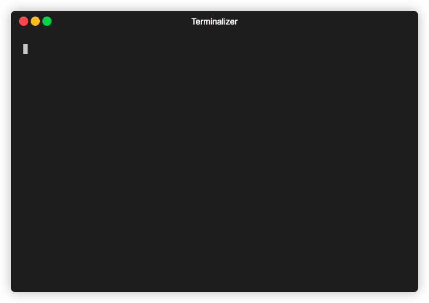

<p align="center">
    
</p>

<h1 align="center">secrets</h1>

<p align="center">
    <a href="https://github.com/karimsa/secrets/actions">
        
    </a>
</p>

Manage secrets in configuration files.

## Installation

```sh
curl -sf https://gobinaries.com/karimsa/secrets/cmd/secrets | sh
```

## Features

 * Encrypt/decrypt selective values
 * Supports yaml, json, and .env files
 * Editor mode to selectively re-encrypt secrets (better git diffs)

## Usage

**Encrypting secrets in a .env file**



```sh
$ cat .env
HELLO=SECURE-WORLD
HI=INSECURE-WORLD
$ secrets encrypt --in .env --out .env --key .HELLO
Passphrase: ******
$ cat .env
HELLO=64745a1f754b45bb60c40e14c04ead39afb0d774e9f25f90459de9f714da3ed19c94063e79649d38b0ebb5cc3eaf06554476cbf7bc65ef0cd472c28370bcdb57105343180700523771733f8cfe2e7222
HI=INSECURE-WORLD
```

**Reveal secrets from .env file**


```sh
$ cat .env
HELLO=64745a1f754b45bb60c40e14c04ead39afb0d774e9f25f90459de9f714da3ed19c94063e79649d38b0ebb5cc3eaf06554476cbf7bc65ef0cd472c28370bcdb57105343180700523771733f8cfe2e7222
HI=INSECURE-WORLD
$ secrets decrypt --in .env --key .HELLO
Passphrase: ******
HELLO=SECURE-WORLD
HI=INSECURE-WORLD
$ cat .env
HELLO=64745a1f754b45bb60c40e14c04ead39afb0d774e9f25f90459de9f714da3ed19c94063e79649d38b0ebb5cc3eaf06554476cbf7bc65ef0cd472c28370bcdb57105343180700523771733f8cfe2e7222
HI=INSECURE-WORLD
```

## License

Licensed under [MIT](LICENSE) license.
